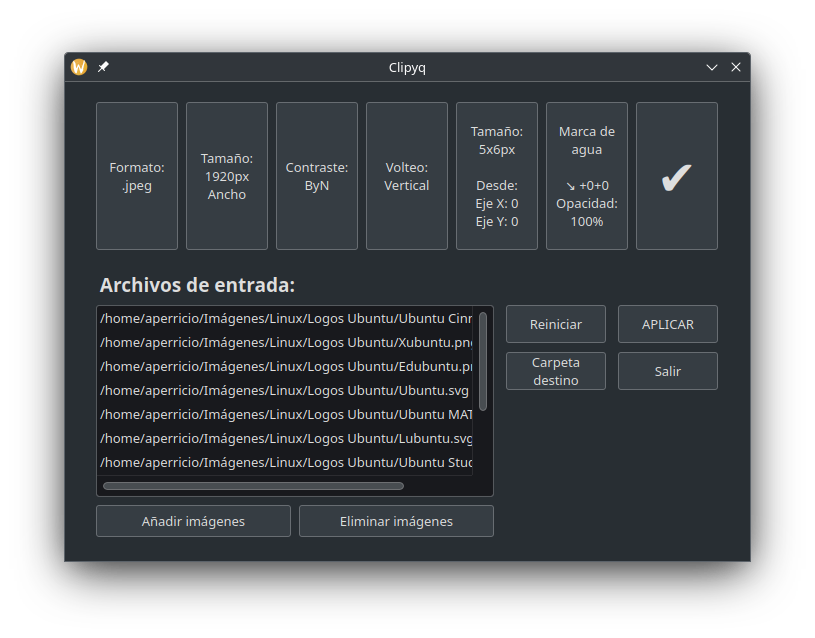
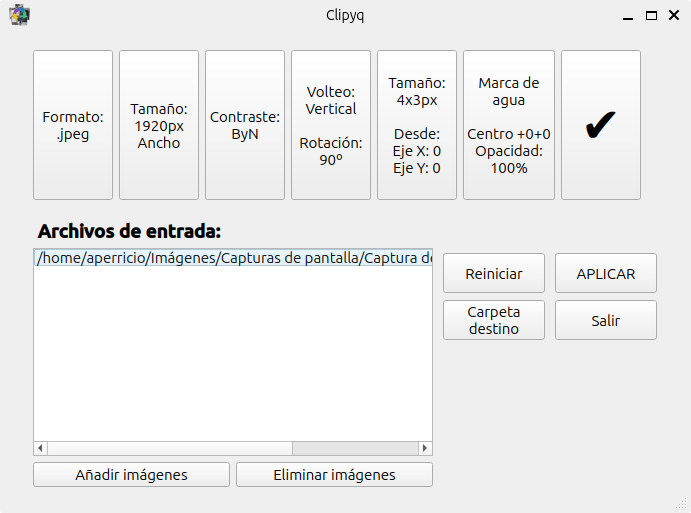

# Clipyq

<p align="center"> </p>

Clipyq son las siglas de <b>C</b>onversor por <b>L</b>otes de <b>I</b>mágenes, en <b>P</b>ython <b>y</b> <b>Q</b>t. Ahí se explicaría gran parte de lo que es este programa.

La idea fue crear una herramienta propia para convertir imágenes por lotes, y para ello me fijé en la extensión [BIMP](https://github.com/alessandrofrancesconi/gimp-plugin-bimp) para GIMP. Sólo la interfaz, y lo que empezó como una prueba terminó en una aplicación bastante avanzada.

Es básicamente un *frontend* para Imagemagick. 

## Requisitos

En estos momentos es sólo un archivo .py y una imagen para el icono, por lo que se puede usar si se instalan los módulos necesarios:

```shell
pip install PyQt5
```

o desde los repositorios oficiales de una distribución Linux si no permite usar `pip`. El comando exacto dependerá del gestor de paquetes y el paquete que haya disponible.

También es necesario [Imagemagick](https://imagemagick.org/script/download.php), ya que es la biblioteca que usa para las conversiones. Está en los repositorios oficiales de la mayoría de distribuciones Linux, y a veces instalado por defecto. Para los usuarios de Windows, no es necesario instalar FFmpeg para poder usar Clipyq.

## Funciones

* Conversión por lotes de imágenes. Ediciones disponibles:
    * Formato.
    * Tamaño.
    * Contraste.
    * Rotación.
    * Recorte.
    * Marca de agua.
* Posibilidad de añadir carpetas completas.
* Posibilidad de indicar carpeta de destino.

La interfaz está en español, pero todo tiene su apartado para la traducción.

## Capturas

### Plasma (Breeze, Manjaro)



### GNOME (Ubuntu)

<p align="center"></p>

